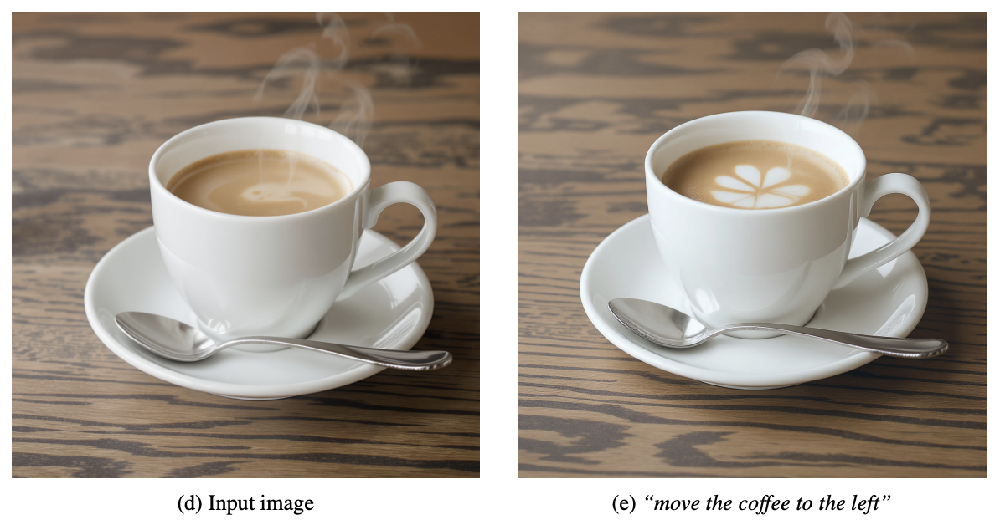

  
[1] flux1.kontext
  
## 백그라운드  
1. **BLF의 kontext 모델의 발표**  
    최근 이미지 딥러닝 모델을 가장 잘 만드는 연구소 중 하나인 Black Forest Labs에서  
    활용도가 매우 높은 모델을 발표하였다.  
    모델의 이름은 `FLUX.1 Kontext`로 이미지 편집(edit) 전용 모델이다.  
  
2. **이미지 생성(generation)과 이미지 편집(editing)의 차이**  
    가장 먼저 input에서 차이가 있다.
    이미지 생성은 주로 "프롬프트"만 입력으로 받는다.  
    이미지 편집은 "레퍼런스 이미지", "프롬프트"를 입력으로 받는다.
  
3. **Kontext 이전의 image edit**  
    기존에는 이미지 생성모델(flux1.dev, Stable diffusion) 등을 이용하여 이미지 편집을 하였다.  
    (e.g., 레퍼런스 이미지의 특정 영역(mask)에 노이즈를 뿌리고 프롬프트를 넣어 새롭게 만들기.)  
    하지만 이와 같은 입력방식에는 큰 단점이 있다.  
    (4번에서 계속)  

4. **기존 생성모델을 이용한 이미지 편집 대비 Kontext의 장점**  
    편집될 영역(mask)을 의식적으로 생각하여 명시적으로 지정한다는 것은 매우 어렵고 피곤한 일이다.  
    실수로 해당 영역 지정을 놓치게 된다고 하면,  
    [2] LaMa failcase와 같이 이미지는 수정되었는데  
    기존 물체의 그림자가 남는 것과 같이 기형적인 이미지가 생성된다.  
    하지만 Kontext는 영역 지정이 아닌 프롬프트만을 받아 instruction을 수행하므로  
    이미지 전체 영역에서 수정을 쉽게 할 수 있다.  
    e.g., 아래 LaMa에서의 failcase와는 다르게  
    `remove couple from image`라는 프롬프트만으로  
    객체와 관련된 그림자와 명암을 전체적으로 조절하여 이미지 편집을 수행한다.  
    
    [2] LaMa failcase
  
## 레포트  
tech report의 포인트만 정리해보았다.  
1. **offers**  
  Unified capability  
  local editing(국소 편집) (e.g., 레퍼런스 이미지 차량의 색상 변경)  
  generative editing(생성적 편집) (e.g., 레퍼런스 이미지 차량이 고속도로에 있도록 변경)  
  모두가 수행 가능하도록 염두에 두고 설계한 모델임.  
   
  Interactive speed  
  1024×1024 이미지 합성에 3~5초 소모됨.  
   
  Iterative application  
  여러 차례 연속 편집을 통해서 이미지를 지속해서 변경 가능함.  
  
  [3] flux1.kontext tech report  

2. **performance**  
  Character Preservation & Text Editing  
  캐릭터의 특성을 유지하며 이미지를 편집하는 작업,  
  글자를 수정하는 작업에서 SOTA 성능을 보여줌.  
  
  [4] flux1.kontext tech report  

3. **limitation**  
  확률적으로 identity degradation이 일어나는 경우가 존재함.  
  prompt의 지시사항을 어기는 경우가 존재함.  
  많은 반복을 할 경우 이미지에 아티팩트가 생성될 수 있음.  
  
  
  
  [5] flux1.kontext tech report
  
## 실무에서 활용 방안  
1. **데이터 수집**  
    현업에서 이미지 생성 엔지니어 업무를 하면서 가장 어려운 점은 모델 튜닝 시  
    목적 분포에 적절한 데이터를 모으는 것이었다.  
    이 작업을 훌륭하게 잘 소화해낼 수 있다.  
    (e.g., "동양인 20대 여성 이미지", "음식을 먹고 있는 나이든 서양인")   
  
2. **데이터 정제**  
    수집된 데이터의 정제에 사용할 수 있다.  
    (e.g., 이미지 전체를 돌면서 밝게 만들거나 어둡게 만들기)  
    또는 GPT를 이용하여 특정 요소(attribute)를 인지 후 명시하여  
    원하는 분포에 들어오도록 편집을 수행할 수 있다.  
    (e.g., GPT로 이미지의 객체 파악 → kontext로 지우는 프로세스)  
  
---
[1] https://bfl.ai/announcements/flux-1-kontext  
[2] https://medium.com/gliacloud/removing-any-object-from-your-photo-with-lama-7e966765fadc  
[3] https://cdn.sanity.io/files/gsvmb6gz/production/880b072208997108f87e5d2729d8a8be481310b5.pdf  
[4] https://cdn.sanity.io/files/gsvmb6gz/production/880b072208997108f87e5d2729d8a8be481310b5.pdf  
[5] https://cdn.sanity.io/files/gsvmb6gz/production/880b072208997108f87e5d2729d8a8be481310b5.pdf  